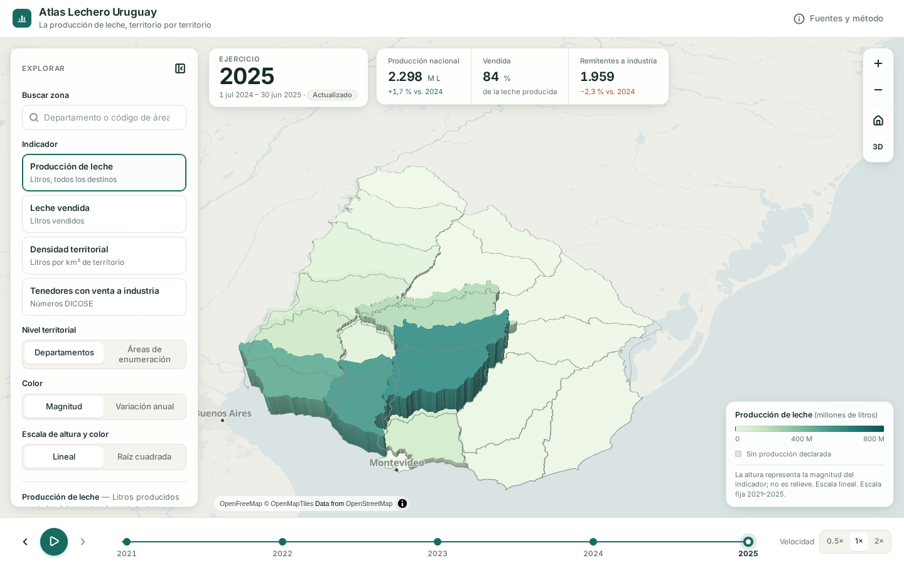
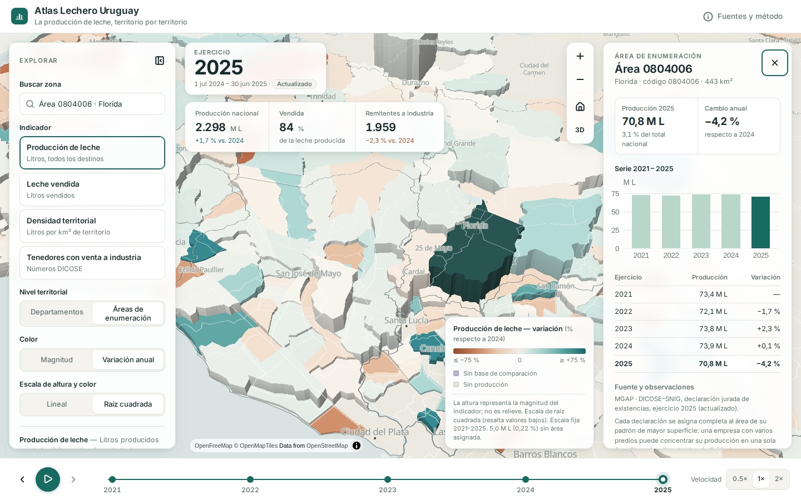
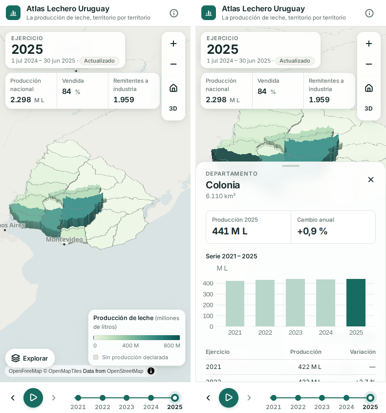
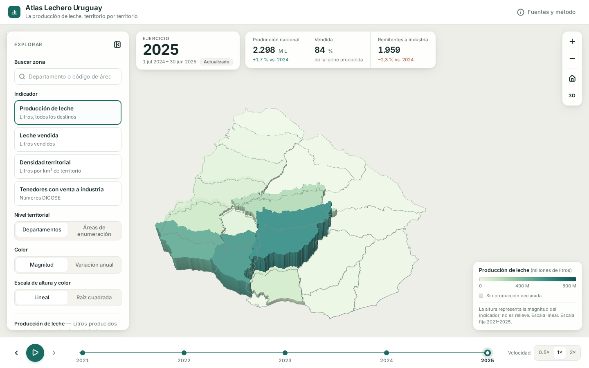

# Atlas Lechero Uruguay

**La producción de leche, territorio por territorio.**

Atlas digital en R/Shiny que muestra cómo cambia la geografía de la lechería uruguaya entre los ejercicios 2021 y 2025. Usa un mapa 3D en WebGL (mapgl + MapLibre) con los polígonos oficiales elevados según la magnitud del indicador. Los datos provienen de las declaraciones juradas DICOSE–SNIG del MGAP.



| Áreas de enumeración, variación anual y detalle | Móvil |
|---|---|
|  |  |

## Ejecutar

Requisitos: R ≥ 4.3 (el `renv.lock` se generó con R 4.5.3). No se necesita ninguna clave ni cuenta.

### RStudio (Windows y macOS)

1. Abra la carpeta del proyecto (`File › Open Project…` o abra `app.R`). La primera vez, renv se instala solo.
2. Instale los paquetes fijados, **una sola vez**:
   ```r
   renv::restore()
   ```
   En Windows y macOS, CRAN ofrece binarios de `sf` y demás: no hace falta instalar GDAL ni compiladores.
3. Abra `app.R` y pulse **Run App**.

### Terminal (Windows PowerShell o macOS Terminal)

Desde la carpeta del proyecto:

```sh
Rscript -e "renv::restore()"                                 # una sola vez
Rscript -e "shiny::runApp('.', launch.browser = TRUE)"       # cada vez
```

En Windows, si `Rscript` no está en el PATH, use la ruta completa, por ejemplo `& "C:\Program Files\R\R-4.5.3\bin\Rscript.exe" -e "..."`.

La app arranca con los datos procesados que vienen en el repositorio (`data/atlas.rds`, 0,4 MB). **No descarga nada ni reinstala paquetes al iniciar.**

### Actualizar los datos (opcional)

```sh
Rscript scripts/run_pipeline.R            # usa la caché de data-raw/
Rscript scripts/run_pipeline.R --refresh  # fuerza la nueva descarga
```

El pipeline descarga las fuentes con caché, tiempo máximo y reintentos. Registra cada archivo en `data-raw/manifest.csv` (URL, fecha de descarga, ejercicio, estado preliminar o actualizado, MD5), valida los datos y regenera `data/`. Para incorporar un ejercicio nuevo (2026), añada su identificador del catálogo a `DICOSE_DATASETS` en `scripts/_common.R`.

### Pruebas

```sh
Rscript tests/run_tests.R
```

Cubren códigos territoriales, ceros, bases cero, expresiones de estilo con escala fija y la lógica del servidor (`shiny::testServer`): cambio de año, selección conservada y paso de un área a su departamento.

## Diagnóstico de los datos

El detalle completo está en [`data/diagnostico.md`](data/diagnostico.md) (se regenera con `scripts/04_validate.R`).

| Ejercicio | Período | Estado | Producción declarada | Remisión INALE (jul–jun) |
|---|---|---|---:|---:|
| 2021 | 1 jul 2020 – 30 jun 2021 | preliminar | 2.283 M L | 2.110 M L |
| 2022 | 1 jul 2021 – 30 jun 2022 | preliminar | 2.201 M L | 2.105 M L |
| 2023 | 1 jul 2022 – 30 jun 2023 | actualizado | 2.275 M L | 2.089 M L |
| 2024 | 1 jul 2023 – 30 jun 2024 | actualizado | 2.260 M L | 2.078 M L |
| 2025 | 1 jul 2024 – 30 jun 2025 | actualizado | 2.298 M L | 2.096 M L |

- **Cobertura:** 637 áreas de enumeración (AE) de DIEA y 19 departamentos. El 100 % de los códigos de AE de las tablas tiene polígono en los cinco ejercicios. Entre 331 y 350 AE declaran leche cada año.
- **Sin asignar:** entre 4,2 y 5,0 M L por ejercicio (≈ 0,2 %) corresponden a establecimientos sin AE. Cuentan en su departamento de registro, no en el mapa de áreas, y la leyenda lo informa.
- **Contraste externo:** la producción declarada equivale a entre 1,05 y 1,10 veces la remisión a planta de INALE en el mismo período julio–junio. Es coherente, porque la producción incluye la industrialización y el consumo en el predio.
- **Controles:** 50 al preparar los datos (uno de ellos es un aviso documentado: la discrepancia entre las capas de AE) y 23 independientes. Ninguno falla.

### Indicadores

| Indicador | Definición | Por qué así |
|---|---|---|
| Producción de leche | Litros de bovinos de leche (especie 11), suma de todos los destinos: 1 cuota o reparto, 2 industria, 3 industrialización en el predio, 4–5 consumo, 10 venta de leche, 11 otros | El tipo 10 no es subtotal: nunca coexiste con 1 o 2 en la misma combinación de atributos (verificado). |
| Leche vendida | Destinos 1 + 2 + 10 | La venta a industria sola cubre entre el 79 y el 88 % de la remisión INALE, y la frontera con «cuota o reparto» cambia entre años (el tipo 1 pasa de 275 a 93 M L). El agregado es estable: entre 0,88 y 0,92 veces la remisión. |
| Densidad territorial | Producción ÷ superficie total del área (km²) | Compara áreas de distinto tamaño. **No es rendimiento por hectárea lechera.** |
| Tenedores con venta a industria | Números DICOSE con destino 2 | Se cuentan dentro de un único destino. No se suman tenedores de destinos distintos: un mismo productor figura en varios. |

Cada indicador se puede ver como **magnitud** o como **variación anual**. La variación usa una escala divergente centrada en cero y distingue tres casos: «sin base de comparación» (el valor anterior es 0; nunca se muestra infinito), «sin producción» (0 en ambos ejercicios) y «sin ejercicio anterior».

### Decisiones y limitaciones

- **No se usa como producción** el recurso «Producción de leche en establecimiento»: sus metadatos lo definen como litros *industrializados en el predio*. Su total coincide con el destino 3, verificado año a año.
- **Códigos:** las tablas escriben `204001` y la cartografía `CCOMPAE = 0204001`. Todo se normaliza como texto de 7 dígitos. Los departamentos DICOSE usan orden alfabético (Montevideo = 10) y la cartografía el orden del INE (Montevideo = 01); se traducen por nombre.
- **Comparabilidad:** los códigos de AE son estables en 2021–2025 y todos casan con la capa vigente. No hay capas históricas publicadas para verificar cambios de límite, por eso se ofrece también el nivel departamental.
- **Dos versiones de los límites de AE:** el MGAP (SNIA) y el SNIG (MapasBase/AAEE) publican la misma cartografía con los mismos códigos (634 comunes; el MGAP añade 3 áreas «xx000» sin datos lecheros), pero digitalizada de forma distinta. La IoU mediana por área es 0,91 y 112 áreas quedan por debajo de 0,8; las superficies difieren un 3 % en la mediana. Los valores no cambian porque el enlace es por código; sí cambian el dibujo y el denominador de la densidad. Se usa la capa del MGAP (la principal indicada). `ATLAS_AE_SOURCE=snig Rscript scripts/03_prepare.R` regenera el atlas con la del SNIG. Ninguna capa publica su fecha de vigencia, así que no se pudo determinar cuál usó DICOSE para asignar los padrones.
- **Asignación territorial:** cada declaración se ubica completa en el AE de su padrón de mayor superficie, según los metadatos. Algunas áreas concentran grandes volúmenes de pocos declarantes. Por ejemplo, la 0601004 (Durazno) reúne ≈ 9 % del total, casi todo industrializado en el predio. La escala de raíz cuadrada (opcional y explícita en la leyenda) permite leer el resto.
- **Cero, faltante y suprimido:** la fuente no suprime valores. Un AE sin filas es cero declarado y se pinta en un tono neutro. No hay ejercicios faltantes entre 2021 y 2025; si los hubiera, la línea temporal los marca como no disponibles.
- **Periodicidad:** ejercicios ganaderos anuales (1 jul – 30 jun). No se inventan datos mensuales. INALE es mensual y solo se suma de julio a junio para el contraste.
- **No se ubican tambos** ni se generan coordenadas: todo valor corresponde a un polígono oficial.
- **Caprinos** (especie 4, ≈ 0,8 M L/año) excluidos: los metadatos indican que esa especie no tiene control de calidad.
- **Departamentos:** capa «Límites Departamentales» del MGAP (SNIA). El recurso del catálogo indicado inicialmente (`3c1b430a…`) responde 404 y queda registrado en el manifiesto. Se excluye el polígono «Límite contestado».
- **Superficies:** las AE no cubren la zona urbana de Montevideo (−30 % de superficie) ni los embalses del río Negro (≤ 6 % en Durazno, Tacuarembó y Río Negro).

## Gráficas y video para difusión

```sh
Rscript scripts/05_graficas.R        # → docs/graficas/*.png (1080 × 1080) y sus tablas CSV
```

- `remision-mensual-por-anio.png`: remisión mensual a planta, una línea por año (INALE).
- `remision-por-ejercicio.png`: la misma serie de julio a junio, alineada con los ejercicios DICOSE.
- `variacion-departamentos.png`: variación de la producción declarada 2021 → 2025 por departamento (DICOSE).

DICOSE no publica producción mensual. Las series mensuales son **remisión a planta** (INALE), que equivale a ≈ 91–95 % de la producción, y así se rotulan.

El video de presentación (30 s, 1920 × 1080, H.264) se genera con la app corriendo en `http://127.0.0.1:3838`:

```sh
npm install playwright        # una vez; requiere Chromium de Playwright y ffmpeg
node tools/video/grabar_video.js cuadros/
ffmpeg -framerate 30 -i cuadros/f%04d.jpg -c:v libx264 -pix_fmt yuv420p -crf 18 -preset slow -movflags +faststart docs/video/atlas-lechero-30s.mp4
```

El guion sustituye el reloj de la página por uno que avanza 1/30 s por cuadro. Así las animaciones salen fluidas aunque el equipo renderice WebGL lentamente.

## Mapa y diseño

- **Altura:** representación estadística de la magnitud, no relieve (lo indica la leyenda). La escala de altura y color es **fija por indicador y nivel para todos los ejercicios**. La altura se reduce al acercar la cámara para que las zonas altas no tapen su entorno.
- **Vista 2D:** mapa coroplético sin extrusión, para comparar sin oclusión. La cámara inicial es oblicua (45°) y se encuadra a Uruguay descontando el espacio de los paneles.
- **Actualizaciones:** el widget se construye una sola vez. Año, indicador, modo, escala, nivel y selección se actualizan con `maplibre_proxy()` (`set_paint_property`, `set_filter`, `set_layout_property`). La cámara, el zoom y la selección se conservan.
- **Transiciones:** MapLibre no interpola cambios de expresiones con datos por entidad, así que cada ejercicio se muestra tal cual se declaró, sin valores intermedios.
- **Reproducción:** avanza por ejercicios reales cada 1,2 s (0,5× = 1,8 s; 2× = 0,7 s) y se detiene al llegar al último. El temporizador vive en el navegador: no hay bucles en el servidor ni descargas durante la reproducción, y todo se detiene al cerrar la página.
- **Rendimiento:** geometrías simplificadas con mapshaper preservando la topología (AE: de 342.570 a 26.735 vértices). Los originales quedan en `data-raw/geo/`. Todo se precarga al iniciar, sin operaciones espaciales en las reacciones.
- **Interfaz:** tipografía Inter servida localmente (SIL OFL), con cifras tabulares y alternativas de sistema. Iconos de una sola familia, Lucide (ISC). Foco de teclado visible. Atajos: ← y → cambian de ejercicio, la barra espaciadora reproduce o pausa, Esc cierra el detalle. En móvil, los paneles son hojas desplegables.

### Mapa base y dependencia de internet

El fondo usa teselas vectoriales de [OpenFreeMap](https://openfreemap.org): gratuitas, sin clave ni registro. Atribución obligatoria, mostrada en el mapa: «OpenFreeMap © OpenMapTiles, datos © colaboradores de OpenStreetMap». Según sus [términos](https://openfreemap.org/tos/), el servicio se ofrece «tal cual» y puede discontinuarse sin aviso.

El estilo (`data/basemap_style.json`, claro y desaturado, con etiquetas mínimas en español) es local: solo las teselas, tipografías y sprites del mapa base requieren internet. Si fallan, la app muestra un aviso, oculta el mapa base y conserva todas las geometrías del atlas. Para trabajar sin conexión, o si OpenFreeMap deja de funcionar:

```sh
ATLAS_OFFLINE=1 Rscript -e "shiny::runApp('.')"                      # macOS / Linux
$env:ATLAS_OFFLINE=1; Rscript -e "shiny::runApp('.')"                # Windows PowerShell
```



## Estructura

```
app.R                     aplicación (UI + servidor)
R/                        utilidades, capas y expresiones del mapa, UI y paneles
scripts/_common.R         descarga con caché, manifiesto, lectura robusta de CSV
scripts/01_download_dicose.R   DICOSE–SNIG 2021–2025 (CKAN)
scripts/02_download_geometry.R áreas de enumeración, departamentos (ArcGIS REST)
scripts/03_prepare.R      base territorial, indicadores, escalas fijas, controles
scripts/04_validate.R     controles independientes y data/diagnostico.md
scripts/run_pipeline.R    todo lo anterior en orden
data-raw/                 originales + manifest.csv (los recursos DICOSE no usados
                          no se versionan; se regeneran con la caché)
data/                     datos procesados que carga la app y tablas CSV abiertas
www/                      CSS, JS, tipografía e iconos locales
tests/                    pruebas testthat
```

## Fuentes

- MGAP · DICOSE–SNIG, datos basados en la declaración jurada de existencias, [2021](https://catalogodatos.gub.uy/dataset/mgap-datos-preliminares-basados-en-la-declaracion-jurada-de-existencias-dicose-snig-2021), [2022](https://catalogodatos.gub.uy/dataset/datos-preliminares-declaracion-jurada-de-existencias-dicose-snig-2022), [2023](https://catalogodatos.gub.uy/dataset/mgap-datos-actualizados-de-la-declaracion-jurada-de-existencias-dicose-snig-2023), [2024](https://catalogodatos.gub.uy/dataset/mgap-datos-preliminares-basados-en-la-declaracion-jurada-de-existencias-dicose-snig-2024), [2025](https://catalogodatos.gub.uy/dataset/mgap-datos-preliminares-basados-en-la-declaracion-jurada-de-existencias-dicose-snig-2025). Licencia de Datos Abiertos de Uruguay.
- MGAP · SNIA, [Áreas de enumeración](https://mapas.mgap.gub.uy/arcgis/rest/services/SNIA_Temas/Unidades_Estad%C3%ADsticas/MapServer/5) y [Límites departamentales](https://mapas.mgap.gub.uy/arcgis/rest/services/SNIA_Temas/UnidadesAdministrativas/MapServer/1).
- INALE, [Remisión a planta](https://www.inale.org/estadisticas/remision-a-planta/) (solo para contraste).
- El Censo General Agropecuario 2024 no se incorporó en esta versión. Es un relevamiento puntual, no una serie anual, y su comparabilidad con DICOSE no se evaluó. Queda como complemento posible.

## Qué se verificó y qué no

Verificado en este entorno con Chromium sin interfaz (WebGL por SwiftShader), a 1440 × 900 y 390 × 844:

- carga, encuadre inicial y cambio de ejercicio con la cámara intacta (zoom, centro e inclinación idénticos);
- reproducción hasta el final;
- selección por clic y por buscador, y paso de un área a su departamento;
- modos de magnitud y variación, escala lineal y de raíz cuadrada, vista 2D;
- tooltip, teclado, ventana de fuentes y método;
- fallo del mapa base (con certificados no confiables y con `ATLAS_OFFLINE=1`);
- ausencia de peticiones a otros dominios que no sean el servidor local y `tiles.openfreemap.org`.

Sin verificar:

- `renv::restore()` desde CRAN en Windows y macOS reales: aquí los paquetes se instalaron con conda-forge (mismas versiones que el lockfile);
- navegadores Safari y Firefox, gestos táctiles en dispositivos reales, rendimiento en GPU modestas y lectores de pantalla.
